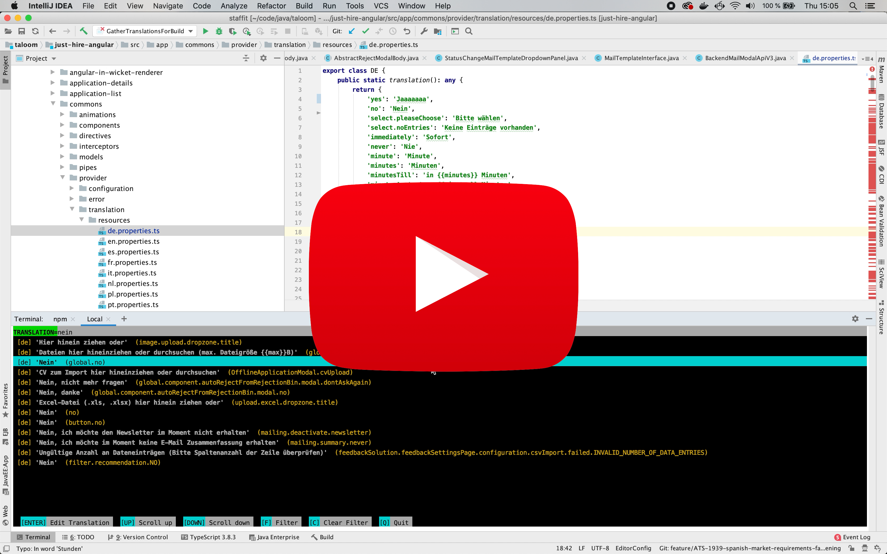

# sg-translations

This tool saves you from touching these messy translation files in just-hire-angular.

## Prerequireties

In order do install or run this tool make sure either PIP or Anaconda is installed and available on your bash.


## Install

The repository's root directory contains a bash script for installation.

`bash install.sh`

#### Caution

Some packages will be installed during the installation. If anaconda is available a seperate environment will be created. If Anaconda is not found PIP will be used instead. This could lead to overwriting existing packages or versions. The usage of Anaconda is highly recommended. You can get it [here](https://www.anaconda.com/).

## translations

Without any argument this tool provides an interactive way to create, update, delete or query all JH Angular translations both by key and by content.
However if you provide a translation key as an argument then the editing mode will be started for this directly.

[](https://youtu.be/U9hK9dsKim8)

### Run

After installation _sg-translations_ is available in your bash using the following command:

`translations [KEY]`

If no path is provided the current directory will be used.

### man
```
usage: translations [-h] [KEY]

Saves you from touching these messy translation files in just-hire-angular.

positional arguments:
  KEY         The key that shall be edited or created. If no key is provided all available translations will be listed.

optional arguments:
  -h, --help  show this help message and exit
```

